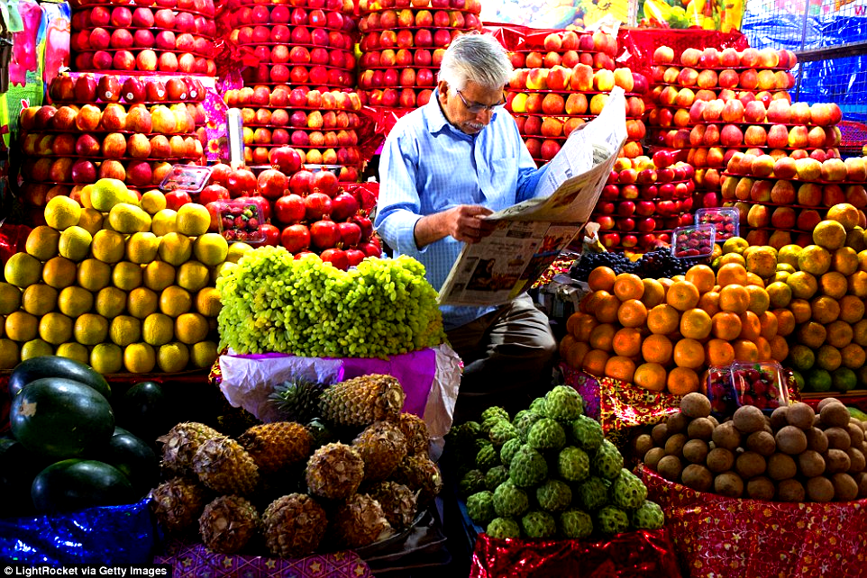
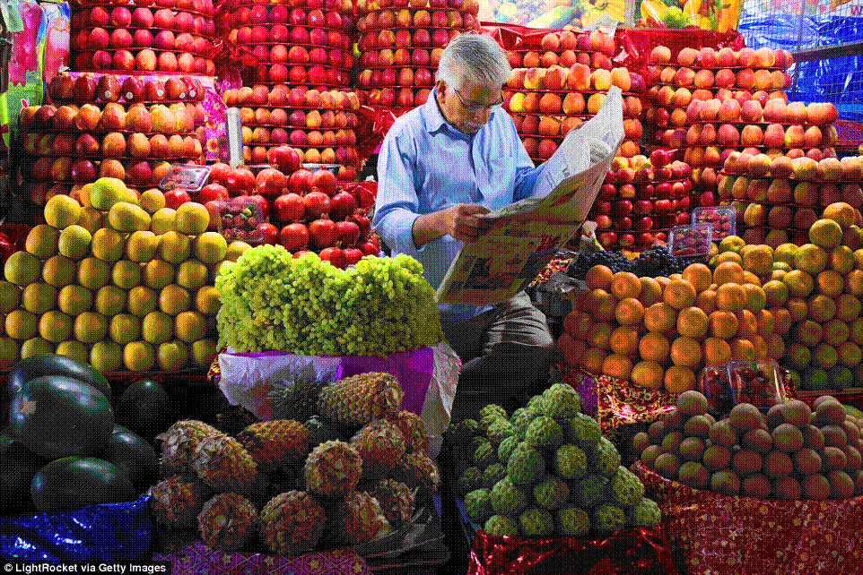
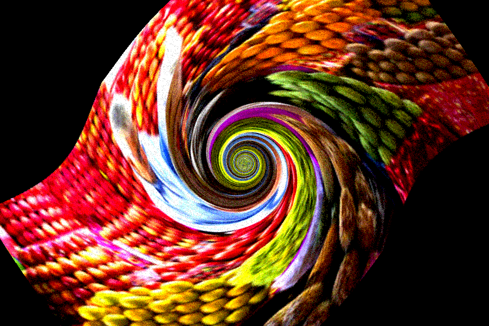

# imagedit-cli
Command Line Image Editor

A	small	number	of	starter	images	are	included	with	the	code,	but	you	can	find	more
in	your	personal	collection	or	online	(https://www.google.com/imghp).	The	images
you	use	must	be	one	of	the	supported	formats	(.bmp,	.jpg/.jpeg,	.png,	.tga).

## Showcase

### [Mangekyō Sharingan](http://naruto.wikia.com/wiki/Mangeky%C5%8D_Sharingan)

|  Original Mangekyō Sharingan         |  Mangekyō Sharingan++          | 
|:-------------------------:|:-------------------------:|
| |   |

### [Kamui](http://naruto.wikia.com/wiki/Kamui)

|  Original          |  Kamui          | 
|:-------------------------:|:-------------------------:|
| |   |

## How	the	Program	Works:

The	program	runs	on	the	command	line	and
performs	operation	in	the	order	that	they	appear	in	the	arguments.	For	example,	to
increase	the	brightness	of	the	image	in.bmp	by	10%,	and	save	the	result	in	the
image	out.bmp,	you	would	type:

`image -input in.bmp -brightness 1.1 -output out.bmp`

Notice	the	input	parameter	must	appear	first.	Remember,	everything	happens	in
the	order	specified.	First	the	input,	then	the	brightness	change,	then	the	writing	to
the	specified	output	file.

For	several	of	the	filters,	there	is	more	than	one	corresponding	argument.	To	see	the
complete	list	of	options,	type:

`image –help`
__________________
```
Usage: image -input <filename> [-option [arg ...] ...] -output <filename>
-help
-input <file>
-output <file>
-noise <factor>
-brightness <factor>
-contrast <factor>
-saturation <factor>
-crop <x> <y> <width> <height>
-extractChannel <channel no>
-quantize <nbits>
-randomDither <nbits>
-blur <maskSize>
-sharpen <maskSize>
-edgeDetect
-orderedDither <nbits>
-FloydSteinbergDither <nbits>
-scale <sx> <sy>
-rotate <angle>
-fun <twistFactor>
-sampling <method no>
```

If	you	specify	more	than	one	option,	the	options	are	processed	in	the	order	that	they
are	encountered.	For	example,

`image -input in.bmp -contrast 0.8 -scale 0.5 0.5 –output out.bmp`

would	first	decrease	the	contrast	of	the	input	image	by	20%,	and	then	scale	down	the
result	by	50%	in	both	x	and	y	directions.	It	is	also	possible	to	specify	-output
multiple	times,	to	save	out	intermediate	results:

`image -input in.bmp -blur 5 -output blurred.bmp -edgeDetect
-output edges.bmp -rotate 30 -output allCombined.bmp`

## Features

### Brightness

|  Original          |  Brigther (1.5)          | Darker (0.5) |
|:-------------------------:|:-------------------------:|:-------------------------:|
| |     |    |

### Contrast

|  Original          |  High Contrast (1.5)          | Low Contrast (0.5) | Negative Contrast (-1) |
|:-------------------------:|:-------------------------:|:-------------------------:|:-------------------------:|
| |     |    |  |

### Saturation

|  Original          |  High Saturation (2)          | Low Saturation (0.5) | Negative Saturation (-1) |
|:-------------------------:|:-------------------------:|:-------------------------:|:-------------------------:
| |     |    |   |

### Random Noise

|  Original          |  More Noise (0.75)          | Less Noise (0.25) |
|:-------------------------:|:-------------------------:|:-------------------------:|
| |     |    |

### Extract Channel

|  Original          |  Extract Green (2)          | 
|:-------------------------:|:-------------------------:|
| |   |

### Crop

|  Original          |  Cropped (243 281 252 104)          | 
|:-------------------------:|:-------------------------:|
| |   |

### Quanitze

|  Original          |  Quantize (2)          | 
|:-------------------------:|:-------------------------:|
| |   |

### Random Dither

|  Original          |  Random Dithered (2)          | 
|:-------------------------:|:-------------------------:|
| |   |

### Ordered Dither

|  Original          |  Ordered Dithered (2)          | 
|:-------------------------:|:-------------------------:|
| |   |

### Floyd Steinberg Dither

|  Original          |  Floyd Steinberg Dithered (2)          | 
|:-------------------------:|:-------------------------:|
| |   |

### Blur

|  Original          |  Blurred (2)          | 
|:-------------------------:|:-------------------------:|
| |   |

### Sharpen

|  Original          |  Sharpened (2)          | 
|:-------------------------:|:-------------------------:|
| |   |

### Edge Detect

|  Original          |  Edge Detections          | 
|:-------------------------:|:-------------------------:|
| |   |

### Scale Up

|  Original          |  Scale (2 3)          | 
|:-------------------------:|:-------------------------:|
| |   |

### Nearest Neighbour Sampling with Scale Down

|  Original          |  Sampling (1) | 
|:-------------------------:|:-------------------------:|
| |   | 

> with Scale (0.25 0.40)

### Bilinear Interpolation Sampling with Scale Down

|  Original          |  Sampling (2) | 
|:-------------------------:|:-------------------------:|
| |   |

> with Scale (0.25 0.40)

### Gaussian Sampling with Scale Down

|  Original          |  Sampling (3)   | 
|:-------------------------:|:-------------------------:|
| |   |

> with Scale (0.25 0.40)

### Rotate with Gaussian Sampling

|  Original          |  Rotate (30)   | Rotate (150)   |
|:-------------------------:|:-------------------------:|:-------------------------:|
| |   |  |

### Swirl with Gaussian Sampling

|  Original          |  Swirl (128)   |
|:-------------------------:|:-------------------------:|
| |   |

### Combination Filter

|  Original          |  Combined Filter   |
|:-------------------------:|:-------------------------:|
| |   |


`image -input fruitsplus.jpg -blur 5 -contrast 1.5 -sampling 3 -rotate 30 -fun 48 -randomDither 2 -output allCombined.png`
