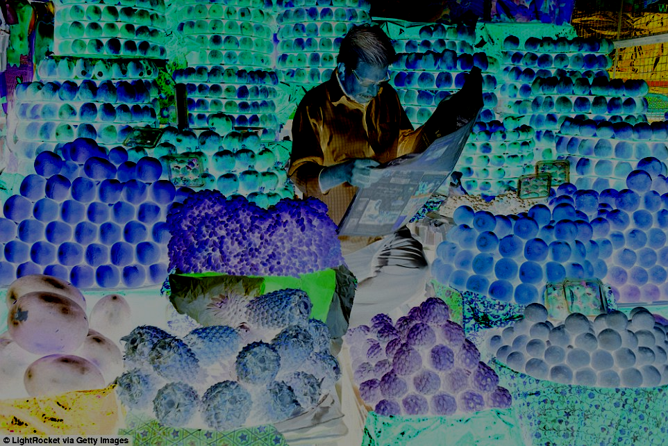

# imagedit-cli
Command Line Image Editor

A	small	number	of	starter	images	are	included	with	the	code,	but	you	can	find	more
in	your	personal	collection	or	online	(https://www.google.com/imghp).	The	images
you	use	must	be	one	of	the	supported	formats	(.bmp,	.jpg/.jpeg,	.png,	.tga).

## Showcase

### [Mangekyō Sharingan](http://naruto.wikia.com/wiki/Mangeky%C5%8D_Sharingan)

|  Original Mangekyō Sharingan         |  Mangekyō Sharingan++          | 
|:-------------------------:|:-------------------------:|
| |   |

### [Kamui](http://naruto.wikia.com/wiki/Kamui)

|  Original          |  Kamui          | 
|:-------------------------:|:-------------------------:|
| |   |

## How	the	Program	Works

The	program	runs	on	the	command	line	and
performs	operation	in	the	order	that	they	appear	in	the	arguments.	For	example,	to
increase	the	brightness	of	the	image	in.bmp	by	10%,	and	save	the	result	in	the
image	out.bmp,	you	would	type:

```image -input in.bmp -brightness 1.1 -output out.bmp```

Notice	the	input	parameter	must	appear	first.	Remember,	everything	happens	in
the	order	specified.	First	the	input,	then	the	brightness	change,	then	the	writing	to
the	specified	output	file.

For	several	of	the	filters,	there	is	more	than	one	corresponding	argument.	To	see	the
complete	list	of	options,	type:

```image –help```
* * * * * * *
```
Usage: image -input <filename> [-option [arg ...] ...] -output <filename>
-help
-input <file>
-output <file>
-noise <factor>
-brightness <factor>
-contrast <factor>
-saturation <factor>
-crop <x> <y> <width> <height>
-extractChannel <channel no>
-quantize <nbits>
-randomDither <nbits>
-blur <maskSize>
-sharpen <maskSize>
-edgeDetect
-orderedDither <nbits>
-FloydSteinbergDither <nbits>
-scale <sx> <sy>
-rotate <angle>
-fun
-sampling <method no>
```

If	you	specify	more	than	one	option,	the	options	are	processed	in	the	order	that	they
are	encountered.	For	example,

```image -input in.bmp -contrast 0.8 -scale 0.5 0.5 –output out.bmp```

would	first	decrease	the	contrast	of	the	input	image	by	20%,	and	then	scale	down	the
result	by	50%	in	both	x	and	y	directions.	It	is	also	possible	to	specify	-output
multiple	times,	to	save	out	intermediate	results:

```image -input in.bmp -blur 5 -output blurred.bmp -edgeDetect -output edges.bmp -rotate 30 -output allCombined.bmp```

### Download

Image CPP File [here](https://raw.githubusercontent.com/debowin/imagedit-cli/master/image.cpp).

Image Executable File [here](https://raw.githubusercontent.com/debowin/imagedit-cli/master/image).

## Features

### Brightness

|  Original          |  Brigther (1.5)          | Darker (0.5) |
|:-------------------------:|:-------------------------:|:-------------------------:|
| |     |    |

### Contrast

|  Original          |  High Contrast (1.5)          | Low Contrast (0.5) | Negative Contrast (-1) |
|:-------------------------:|:-------------------------:|:-------------------------:|:-------------------------:|
| |     |    |  |

### Saturation

|  Original          |  High Saturation (2)          | Low Saturation (0.5) | Negative Saturation (-1) |
|:-------------------------:|:-------------------------:|:-------------------------:|:-------------------------:
| |     |    |   |

### Random Noise

|  Original          |  More Noise (0.75)          | Less Noise (0.25) |
|:-------------------------:|:-------------------------:|:-------------------------:|
| |     |    |

### Extract Channel

|  Original          |  Extract Green (1)          |
|:-------------------------:|:-------------------------:|
| |   |

### Crop

|  Original          |  Cropped (243 281 252 104)          | 
|:-------------------------:|:-------------------------:|
| |   |

### Quantize

|  Original          |  Quantize (2)          | 
|:-------------------------:|:-------------------------:|
| |   |

### Random Dither

|  Original          |  Random Dithered (2)          | 
|:-------------------------:|:-------------------------:|
| |   |

### Ordered Dither

|  Original          |  Ordered Dithered (2)          | 
|:-------------------------:|:-------------------------:|
| |   |

### Floyd Steinberg Dither

|  Original          |  Floyd Steinberg Dithered (2)          | 
|:-------------------------:|:-------------------------:|
| |   |

### Blur

|  Original          |  Blurred (7)          | 
|:-------------------------:|:-------------------------:|
| |   |

### Sharpen

|  Original          |  Sharpened (11)          | 
|:-------------------------:|:-------------------------:|
| |   |

### Edge Detect

|  Original          |  Edge Detections          | 
|:-------------------------:|:-------------------------:|
| |   |

### Scale Up

|  Original          |  Scale (2 3)          | 
|:-------------------------:|:-------------------------:|
| |   |

### Nearest Neighbour Sampling with Scale Down

|  Original          |  Sampling (0) |
|:-------------------------:|:-------------------------:|
| |   | 

> with Scale (0.25 0.40)

### Bilinear Interpolation Sampling with Scale Down

|  Original          |  Sampling (1) |
|:-------------------------:|:-------------------------:|
| |   |

> with Scale (0.25 0.40)

### Gaussian Sampling with Scale Down

|  Original          |  Sampling (2)   |
|:-------------------------:|:-------------------------:|
| |   |

> with Scale (0.25 0.40)

### Rotate with Gaussian Sampling

|  Original          |  Rotate (30)   | Rotate (150)   |
|:-------------------------:|:-------------------------:|:-------------------------:|
| |   |  |

### Swirl with Gaussian Sampling

|  Original          |  Swirl   |
|:-------------------------:|:-------------------------:|
| |   |

### Combination Filter

|  Original          |  Combined Filter   |
|:-------------------------:|:-------------------------:|
| |   |


```image -input fruitsplus.jpg -blur 5 -contrast 1.5 -sampling 2 -rotate 30 -fun -randomDither 2 -output allCombined.png```

## Challenges

* **Random Dither** - I wasn't sure how to apply it for arbitrary bit depth so I broke the current bit depth into Most Significant and Least Significant
portions and generated a random number between 0 and the LSB's maximum value. Then I checked if this number was less than or greater than the Least Significant portion.
If it was lesser, I increased the value of the Most Significant portion by one to retain in my new bit depth representation.

* **Quantization** - Taking remainders and quotients the regular way was making the code look dirty and unintelligible so I moved to
bit-wise arithmetic for rounding operations.

* **Brightness Reduction** - Had to reset the alpha value to pixel's original value because pixel arithmetic in case of a <1 factor was reducing it, leading to a translucent image.

* **Random Noise** - In this case, I used a Noise Pixel with random values between -256 and 256 instead of 0 to 256 so that the noisy image doesn't become too bright.

* **Blur** - I created a generic Gaussian1D kernel creator function that can be used to create a kernel of any size.
I also used a variable sigma = size/2 to make the blurring even smoother for higher values of n. I used this to apply blurring two times, once for each dimension.

* **Edge Detection** - Read about the Sobel Filter that has impressive edge detection. Used a 3x3 Sobel Filter after darkening the image and scaling it down and back up
for being able to detect larger and darker edges. (more prominent ones)

* **Rotation** -  Was unable to get it to rotate it in place till I realized that I needed to add the center coordinates to each pixel's old coordinates(u, v) when we were inverse mapping.

* **Fun** - Realizing the trick about rotation got me thinking towards a differential spinning warp. So I came up with two approaches to rotate pixels differently.
One twists them more the farther from the center they are, and one that does the opposite. Finally, I decided to go with the latter for which I had to take care of the division by zero
in case of the middle pixel i.e radius = 0 by adding a tiny value to the square-root. I also had to do a memcpy to copy my result Image to the original Image since
I was forced by the header file to use a void return type for the fun function and we were only allowed to change the image.cpp file.

* **Sampling** - For bilinear interpolation, it took me some time to arrive at the idea of chaining the interpolations for the upper and lower neighboring pixels.
For Gaussian sampling, I realized I couldn't use a kernel after repeated failures of trying to do so. To this end, I wrote a utility function that gives the value
of the gaussian term for any x and y and sigma and used it for convolution.
